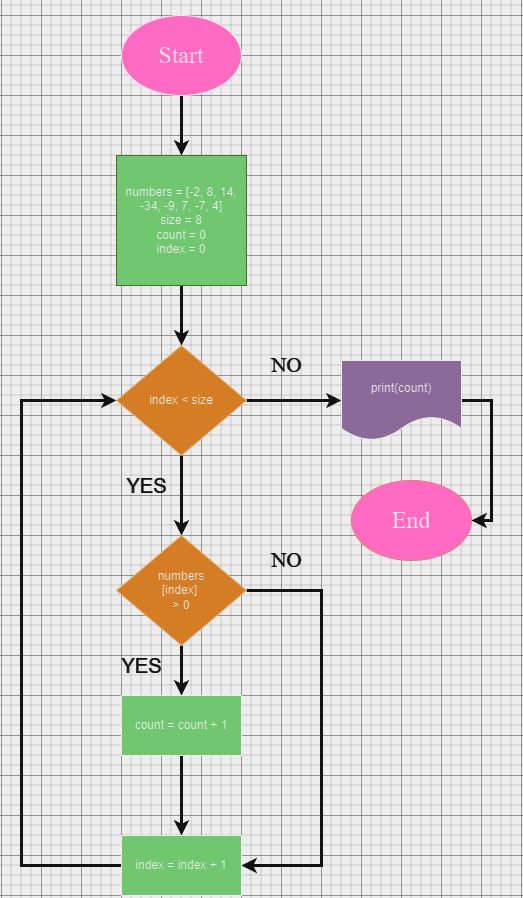
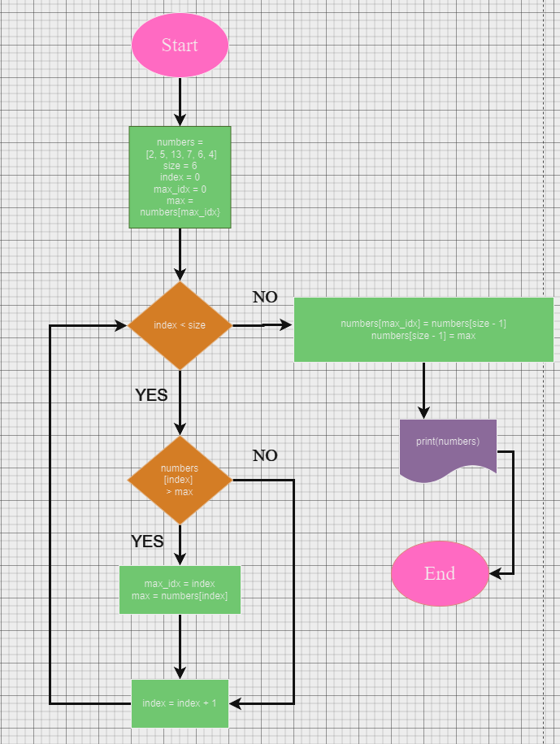

# Алгоритмы

## Task1

> Напишите псевдокод по блок-схеме.

> Подсчитать количество положительных чисел 

> в произвольно заданном массиве

> [-2, 8, 14, -34, -9, 7, -7, 4]

## Task2

> Напишите псевдокод по блок-схеме.

> Перенести самое большое значение

> элемента в правый край массива.

> [2, 5, 13, 7, 6, 4]

